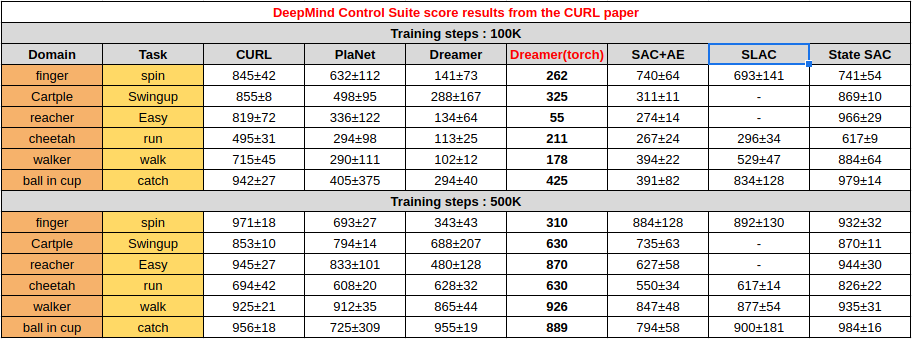
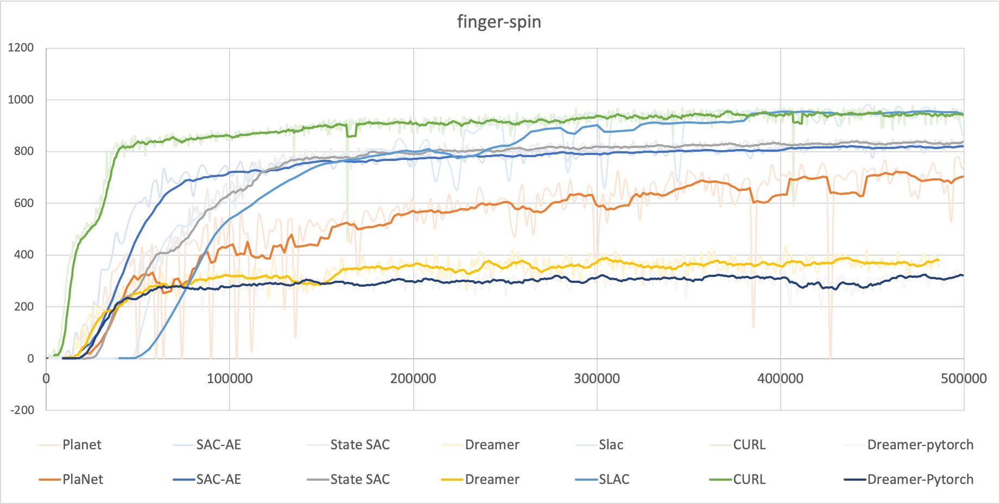
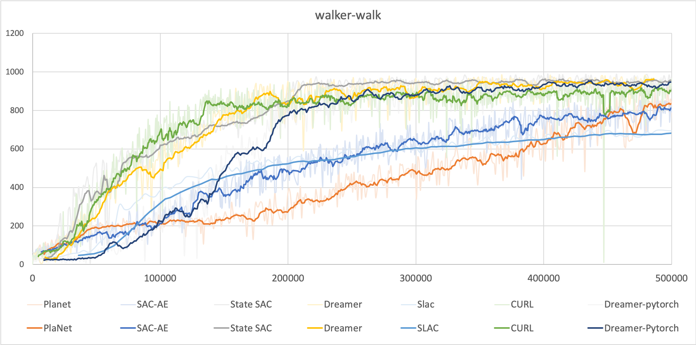
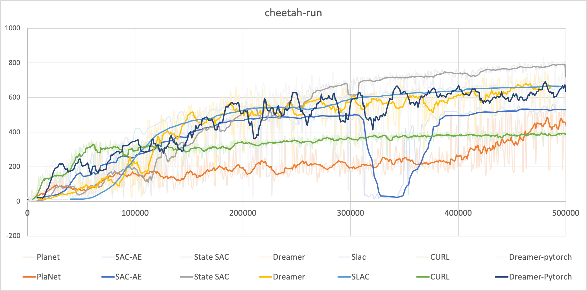
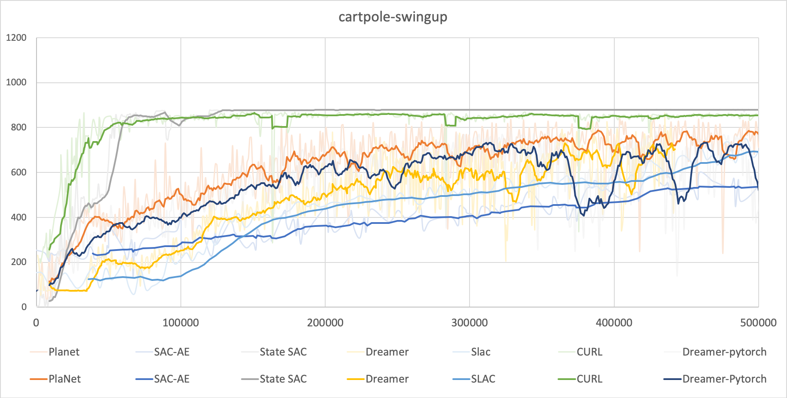
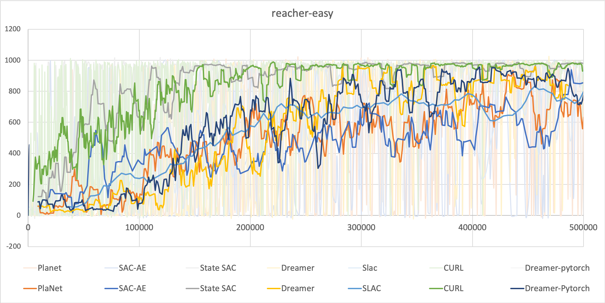
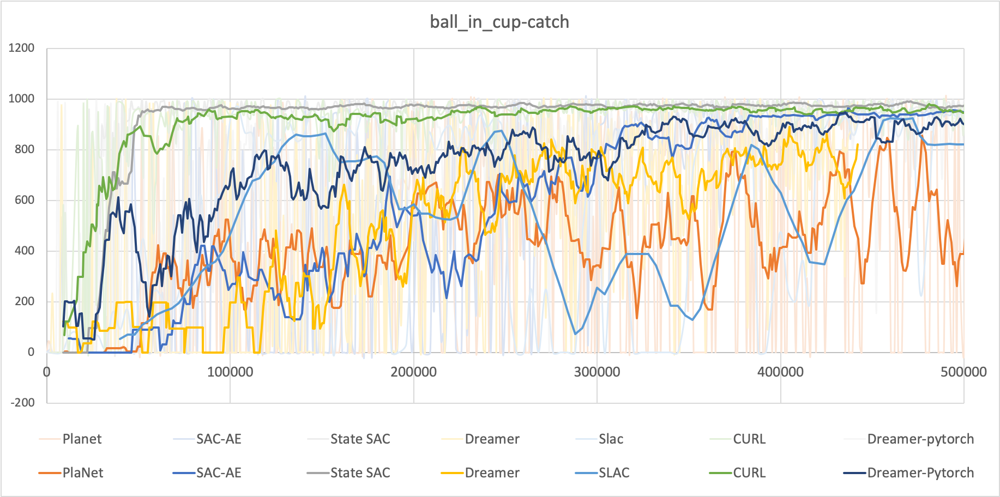

Dreamer implementation in PyTorch
======

[](LICENSE.md)

## Dreamer-torch1.8.2
### **Updated the code to catch up with the latest pytorch version.**

### **Previous version for pytorch 1.4 is left at `dreamer` branch.**

### Not conpatible with open-source Mujoco yet. Please download and use mujoco-200 and free license key from [here](https://www.roboti.us/)

This repo implements the Dreamer algorithm from [Dream to Control: Learning Behaviors By latent Imagination](https://arxiv.org/pdf/1912.01603.pdf) based on the [PlaNet-Pytorch](https://github.com/Kaixhin/PlaNet). It has been confirmed working on the DeepMind Control Suite/MuJoCo environment. Hyperparameters have been taken from the paper.

## Installation
To install all dependencies with Anaconda run using the following commands. 

`conda env create -f conda_env.yml` 

`source activate dreamer` 

## Training (e.g. DMC walker-walk)
```bash
python main.py --algo dreamer --env walker-walk --action-repeat 2 --id name-of-experiement
```

For best performance with DeepMind Control Suite, try setting environment variable `MUJOCO_GL=egl` (see instructions and details [here](https://github.com/deepmind/dm_control#rendering)).

Use Tensorboard to monitor the training.

`tensorboard --logdir results`

## Results
The performances are compared with the other SoTA algorithms as follows 
(Note! Tested once using seed 0.)

* [State-SAC](https://github.com/denisyarats/pytorch_sac)
* [PlaNet-PyTorch](https://github.com/Kaixhin/PlaNet)
* [SAC-AE](https://github.com/denisyarats/pytorch_sac_ae)
* [SLAC](https://github.com/ku2482/slac.pytorch)
* [CURL](https://github.com/MishaLaskin/curl)
* [Dreamer (tensorflow2 implementation)](https://github.com/danijar/dreamer)

### NOTE! All the steps below are environment steps. (All the results below are trained 1000 episodes. Each espisode length is 1000 steps. Actual number of sampled data are steps/action_repeat. )

<p align="center">
  
</p>

<p align="center">
  
  
  
  
  
  
</p>

Pretrained models can be found in the [releases](https://github.com/Kaixhin/PlaNet/releases).

## Links
- [Dream to Control: Learning Behaviors By latent Imagination](https://ai.googleblog.com/2020/03/introducing-dreamer-scalable.html)
- [google-research/dreamer](https://github.com/google-research/dreamer)
